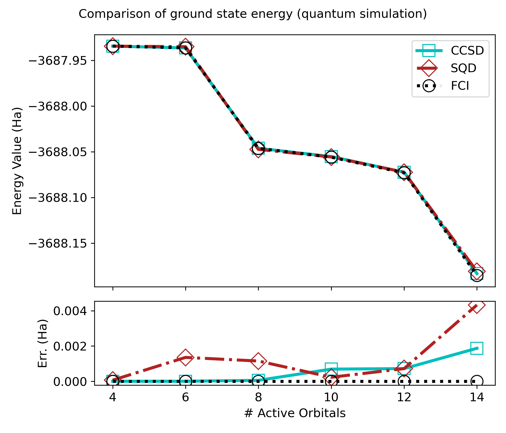
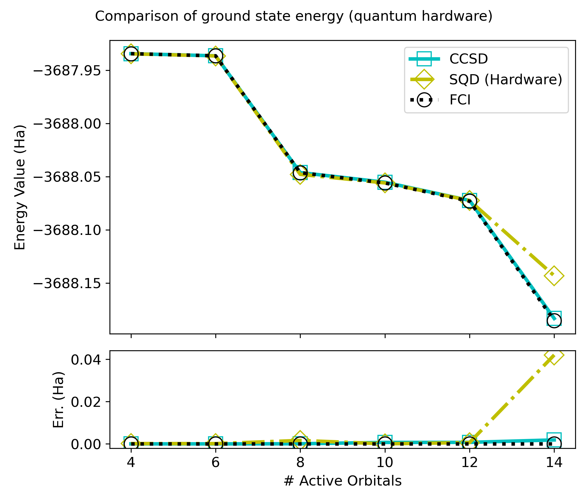
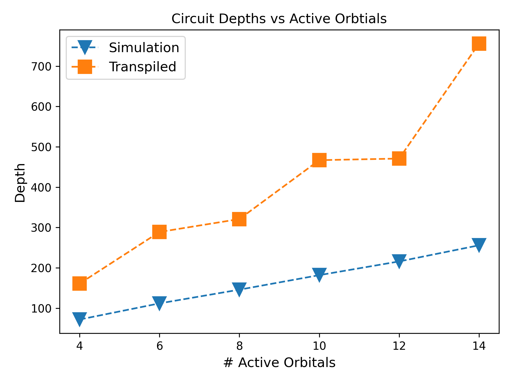
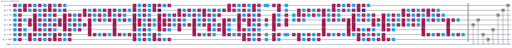
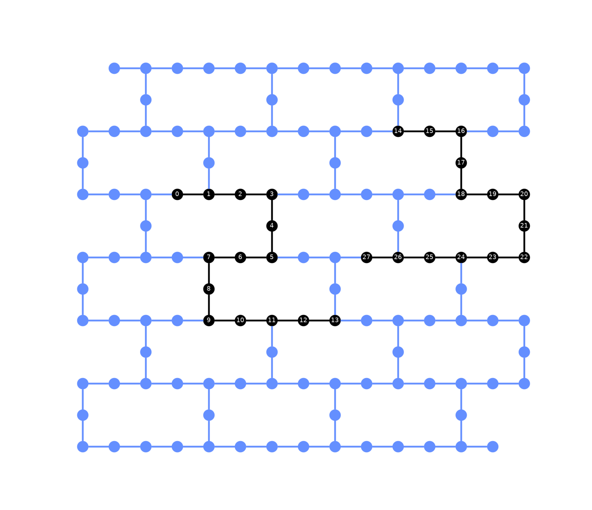

# Simulating Batteries through Sample-Based Quantum Diagonalization

## Team 4 – Battery Materials Discovery – EPFL, QSE Centre

Members: Gopal Ramesh Dahale, Dawid Grabowski, Hugo Izadi, Jad Mchaimech, Billy Nyaga, Mai Salama

## Abstract

This project investigates the application of Sample-Based Quantum Diagonalization (SQD) and its extended version (Ext-SQD) to simulate key properties of lithium-ion battery materials. We focus on dilithium iron silicate (Li₂FeSiO₄) as a sustainable cathode material, employing quantum computing techniques to calculate ground-state energies that are essential for determining battery properties such as equilibrium voltage, ionic mobility, and thermal stability. Our hybrid quantum-classical approach leverages the Local Unitary Cluster Jastrow (LUCJ) ansatz for efficient state preparation and demonstrates improved accuracy over traditional Coupled Cluster Singles and Doubles (CCSD) calculations.

## Motivation

### Global Impact and SDG Alignment
- **Wildfire Response**: Firefighters need lightweight, long-autonomy drones for surveillance within the critical 20-minute intervention window (30-30-30 rule)
  - **SDG 13**: Climate Action
  - **SDG 15**: Life on Land

- **Electric Vehicle Safety**: Battery weight constitutes ~30% of electric truck mass, increasing braking distances by up to 50% and brake wear emissions by 45%
  - **SDG 3**: Good Health and Well-being
  - **SDG 6**: Clean Water and Sanitation  
  - **SDG 9**: Industry, Innovation and Infrastructure
  - **SDG 13**: Climate Action

### Why Ground State Energy Matters
- **Battery Properties Derivation**: Many critical battery characteristics can be computed from ground-state energies:
  - Equilibrium cell voltage
  - Ionic mobility
  - Thermal stability
- **Material Discovery**: Enables computational screening of new, cheaper, and more sustainable battery materials
- **Quantum Advantage**: Current classical methods struggle with strong electron correlation effects, particularly in surface reactions

### Why SQD is Promising
- **Scalability**: Handles larger molecular systems than exact quantum methods
- **Noise Resilience**: Better suited for near-term quantum devices
- **Hybrid Efficiency**: Combines quantum sampling with classical post-processing
- **Resource Optimization**: Reduces qubit requirements compared to traditional approaches

## Files

### Core Implementation
- `1_classical`: Classical baseline calculations using CCSD and FCI methods for Li₂FeSiO₄
- `2_sqd: SQD implementation with quantum circuit simulation using Qiskit Aer
- `3_sqd_hardware.py`: Hardware-ready SQD implementation for IBM quantum processors
- `4_plots`: Visualization and analysis of computational results

### Data and Structure
- `Li2FeSiO4.cif`: Crystal structure file for dilithium iron silicate
- `results/`: Contains computational results, energies, and visualization outputs

### Key Features
- **Li₂FeSiO₄ Analysis**: Sustainable cathode material (abundant Si, Fe) with high thermal stability
- **Active Space Selection**: Systematic orbital freezing to manage computational complexity
- **LUCJ Ansatz**: Local Unitary Cluster Jastrow state preparation for quantum circuits
- **Quantum-Classical Hybrid**: Combines quantum sampling with classical configuration interaction

## Results

### Computational Performance

*Comparison of ground state energies across different computational methods showing SQD accuracy*

*Hardware implementation results demonstrating quantum-classical hybrid performance*

### Quantum Circuit Implementation

*Circuit depth scaling analysis for different active space sizes*

*Quantum circuit implementation on 8-qubit system*

*Mapping of 28-qubit quantum circuit to IBM quantum processor topology*

### Key Findings
- Quantum methods, when properly integrated with classical solvers, can offer tangible improvements in computational chemistry for materials discovery
- Successful implementation on near-term quantum hardware with up to 28 qubits

## Challenges

### Technical Limitations
- **Noise Resilience**: Current quantum processors suffer from decoherence and gate errors
- **Circuit Depth Limitations**: Deep quantum circuits required for large molecular systems exceed coherence times
- **Efficient State Preparation**: Preparing high-quality trial states remains computationally demanding

### Scaling Considerations
- **Alternative Quantum Ansatz**: Need for more efficient ansätze beyond LUCJ for larger systems
- **Resource Requirements**: Exact quantum methods limited to small molecules; large molecules require >2000 qubits
- **Classical-Quantum Interface**: Optimizing the hybrid workflow for maximum efficiency

## Acknowledgements

We thank the Open Quantum Institute (OQI) at CERN and the University of Geneva for organising the first Quantum Materials Hackathon. We also thank the EPFL QSE Centre. 

### References
- Delgado, A., et al. "Simulating key properties of lithium-ion batteries with a fault-tolerant quantum computer"
- Fomichev, S., et al. "Simulating X-ray absorption spectroscopy of battery materials on a quantum computer"
- Robledo-Moreno, J., et al. "Chemistry Beyond Exact Solutions on a Quantum-Centric Supercomputer"
- Barroca, M. A., et al. "Surface Reaction Simulations for Battery Materials through Sample-Based Quantum Diagonalization and Local Embedding"